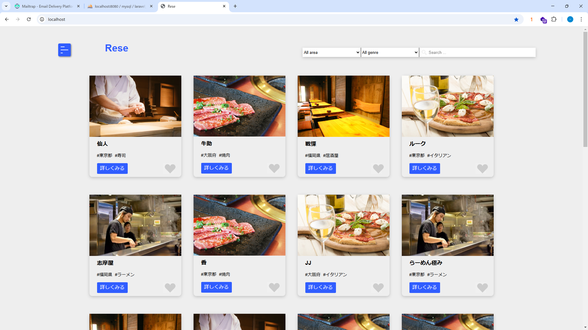
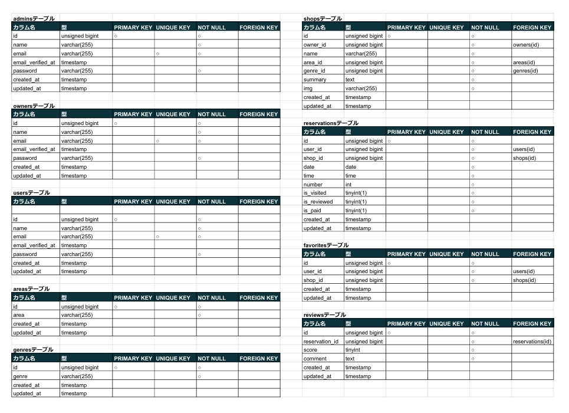
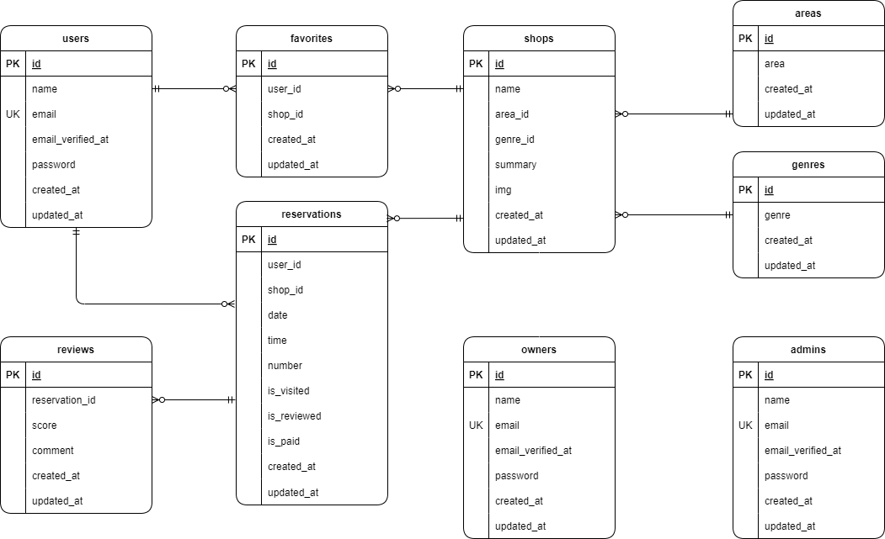
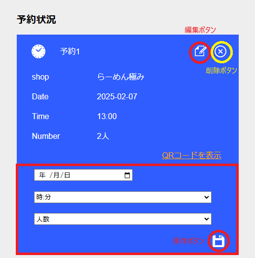
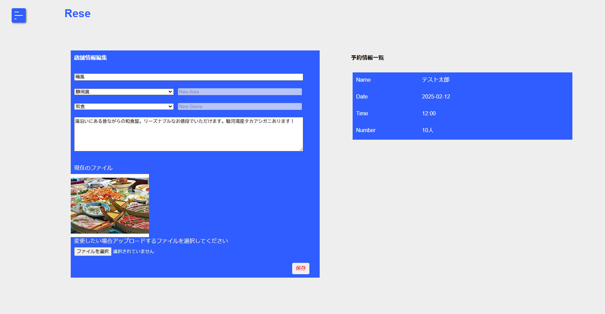
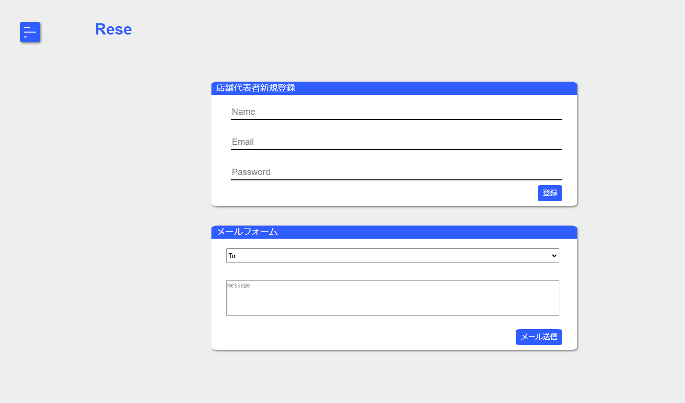

# Rese（リーズ）

ある企業のグループ会社の飲食店予約サービス


## 作成した目的

外部の飲食店予約サービスは手数料を取られるので自社で予約サービスを持ちたい。

## アプリケーション URL

・ 開発環境：http://localhost/  
・ phpMyAdmin：http://localhost:8080

## 他のリポジトリ

### ストレージ

店舗画像保存：/src/storage/app/images  
QR コード保存：/src/storage/app/code

## 機能一覧

### 【利用者】

ユーザー登録・メール認証・ログイン・ログアウト，店舗予約・店舗予約削除・店舗予約変更，  
QR コード，店舗評価，お気に入り，リマインダー，stripe 決済

### 【店舗代表者】

メール認証・ログイン・ログアウト，店舗情報登録・店舗情報変更

### 【管理者】

ログイン・ログアウト，店舗代表者登録，メール送信

## 使用技術

・PHP 8.1.29  
・Laravel 10.48.20  
・phpMyAdmin 5.2.1  
・MySQL 8.0.26  
・nginx 1.21.1

## テーブル設計



## ER 図



# 環境構築

## 1．Docker ビルド

1-1．git clone リンク  

1-2．DockerDesktop アプリを立ち上げる  
MySQL は、docker-compose.yml ファイルを編集する。  

1-3．docker-compose up -d --build

## 2．Laravel 環境構築

2-1．コンテナ内にログイン

```
docker-compose exec php bash
```

2-2．composer.json に記載されたパッケージのリストをインストールする

```
⁠composer install
```

2-3．.env.example ファイルから.env ファイルを作成し、環境変数を変更、以下の設定を追加

【Mail 設定】

```
MAIL_MAILER=smtp
MAIL_HOST=smtp.example.com
MAIL_PORT=587
MAIL_USERNAME=your_username
MAIL_PASSWORD=your_password
MAIL_ENCRYPTION=tls
MAIL_FROM_ADDRESS=your_email@example.com
MAIL_FROM_NAME="${APP_NAME}"
```

【API キー設定】

```
STRIPE_KEY=your_publishable_key
STRIPE_SECRET=your_secret_key
```

2-4．アプリケーションを実行できるように、PHP コンテナで以下のコマンドを実行する

```
php artisan key:generate
```

2-5．マイグレーションを実行する

```
⁠php artisan migrate
```

2-6．シーディング処理を実行する。

```
php artisan db:seed
```

2-7．シンボリックリンクの作成

```
php artisan storage:link
```

## アカウントの種類

アカウントには管理者(admin)・店舗代表者(owner)・利用者(user)の 3 種類ある。  
ログイン時に ログインページ「ログイン」ボタンの左にあるセレクトボックスからアカウントの種類を選ぶ必要がある。  
管理者(admin)アカウントは 1 つのみで，環境構築時に作成される。  

【管理者アカウント】  
email ：admin@example.com  
password：abcd1234  

店舗代表者(owner)アカウントは，管理者が管理画面で作成する。  
また，ダミーデータとして 20 のアカウントがある。  
利用者(user)アカウントは，利用者が登録ページから作成する。  

未ログイン状態の場合、店舗一覧ページと店舗詳細画面は表示できる。また、店舗一覧ページの絞り込み機能は利用できる。  
しかし、お気に入り機能または予約機能を利用しようとするとログインページに遷移する。  

## ホーム画面

未ログインまたは利用者であれば店舗一覧ページがホーム画面となる。  
店舗代表者および管理者はそれぞれの管理画面がホーム画面となる。  

## 認証

店舗代表者と利用者はログインするのにメールによる認証が必要になる。  
認証が通ってない状態でログインするとに確認メール送信画面に遷移するので「確認メールを送信」をクリックすると、登録したメールアドレスにメールが届く。  
メール内の「Verify Email Address」か URL をクリックするとマイページが開く。  

## バリデーション

RegisterRequest ：ユーザー登録・店舗代表者登録  
LoginRequest ：ログイン  
ReservationRequest：店舗予約・変更  
ShopInfoRequest ：店舗情報登録・店舗情報変更  
SendMailRequest ：メール送信  

## 店舗予約機能

現時刻より 1 時間以上あとの予約時間でないと予約できないようになっている。  
また、予約時間の重複もできないようになっている。  
予約すると QR コード画像が作成される。作成された QR コードはストレージに保存される。ストレージのリポジトリは上記の「他のリポジトリ」を参照する。  
QR コードを読み込むと予約 ID が表示されるようになっている。  

## マイページ

予約状況では、予約情報の確認、変更、削除ができる。さらに QR コードの表示や決済、店舗評価もできる。  
予約時間を超えた予約は来店したものとし右上に赤字で「済」と表示される。  

### 店舗予約変更機能



編集ボタンをクリックすると編集フォーム（赤い枠部）が予約情報の下に表示される。  
再度編集ボタンをクリックすると編集フォームが閉じる。  

編集フォームに入力し保存ボタンをクリックする。無事変更できるとページ上部に「予約を変更しました。」と表示される。  
表示されていない場合は、バリデーションによるエラーが発生している。再度編集ボタンをクリックして編集フォームを開くとエラーメッセージが確認できる。  
なお、予約時間を迎えると編集ボタンおよび削除ボタンは表示されなくなる。  

### 決済について

予約時間を迎えると予約情報の下に決済ボタンが表示されるので、決済ボタンから決済をする。  
決済ボタンをクリックすると金額を入力する欄があるので入力し、「決済をする」ボタンをクリックするとメールアドレスとクレジットカード情報の入力フォームが表示される。  
入力し、「を支払う」ボタンをクリックすると決済される。  
決済が無事成功するとマイページに遷移し、ページ上部に「支払いが完了しました！」と表示され、決済ボタンが表示されなくなる。  

stripe 決済のテストをしたい場合は、PHP コンテナから抜けてから下記のコマンドを実行してローカルサーバーを起動する。  

```
./src/vendor/bin/sail up
```

### 店舗評価機能

決済が無事成功すると店舗予約情報の下にレビューフォームが表示される。  
レビューフォームには、5 段階評価とコメントを記入する。コメントは任意であり未入力でも問題ない。  
レビューを保存すると，予約状況に表示されなくなる。  

## リマインダーメール

予約当日の朝に予約情報のリマインダーメールが送られる。  

メール送信用のテンプレートは下記ファイル。  
/src/resources/views/emails/reminder.blade.php

/src/app/Console/Kernel.php でスケジュールの設定ができる。

```
protected function schedule(Schedule $schedule): void
{
    $schedule->command('email:send-reminders')->dailyAt('08:00');
}
```

スケジュールをローカルで実行するには、PHP コンテナで以下のコマンドを実行する。

```
php artisan schedule:work
```

## 店舗代表者管理画面



### 店舗情報登録・編集

店舗情報は 1 つのみ登録できる。登録店舗がない場合は店舗情報登録フォームが表示され、店舗登録済みであれば店舗情報編集フォームが表示される。  
情報は上から店舗名、地域名、ジャンル名、概要、店舗画像を入力する。  
地域名およびジャンル名はセレクトボックスから選択するが、セレクトボックスにない場合は「その他」を選択すると右の「New Area」、「New Genre」がそれぞれ入力できるようになるので入力する。  
「New Area」、「New Genre」はそれぞれ地域名一覧、ジャンル名一覧に自動的に保存されるようになっている。  
選択できるファイルは 2MB までの画像ファイルである。ここでアップロードした画像ファイルはストレージに保存される。ストレージのリポジトリは上記の「他のリポジトリ」を参照する。  

店舗情報変更で画像をアップロードすると前の画像は削除されるようになっている。  
保存ボタンをクリックして無事変更できるとページ上部に「店舗情報を変更しました。」と表示される。  

バリデーションの設定あり。  

### 予約情報一覧

予約情報が日時順で表示される。予約時間を迎えると一覧から表示されなくなる。

## 管理者管理画面



### 店舗代表者登録

店舗代表者の名前、メールアドレス、パスワードを登録できる。  
登録に成功すると、管理画面上部に「店舗代表者を登録しました。」と表示される。  
利用者登録機能と同様のバリデーションを設定している。  

### メール送信機能

メール送信機能は，管理者の管理画面から店舗代表者へ一括または個別にメールを送信することができる。  
「To」と表示されているセレクトボックスから送信先となる店舗代表者を選択する。一括を選択すると登録してある店舗代表者全員に送信する。  
「Message」に本文を記入する。  
「送信」ボタンをクリックすると「To」で選択した対象にメールが送信される。  
バリデーションの設定あり。

メール送信用のテンプレートは下記ファイル。  
/src/resources/views/emails/info.blade.php

## その他

例えば、店舗代表者としてログアウトした後利用者としてログインしようとしたなど、続けて別種のアカウントでログインしようとした際に、  
ホーム画面が前のアカウント種のロホーム画面に接続する場合がある。  
この時は再度前のアカウントでログイン、ログアウトしたりキャッシュをクリアすると改善する可能性がある。  
